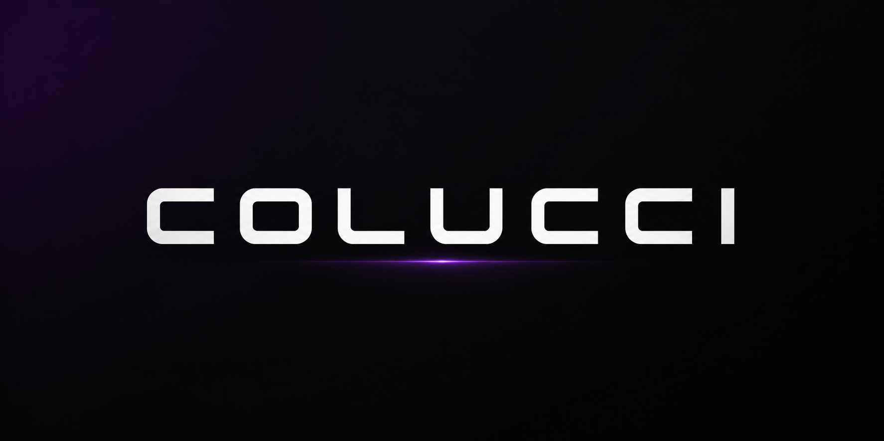

  

<h1 align="center">COLUCCI</h1>

  reverse engineering • software security • backend development

 

  

  
  
  
  

 

software security • reverse engineering • binary analysis • deobfuscation

